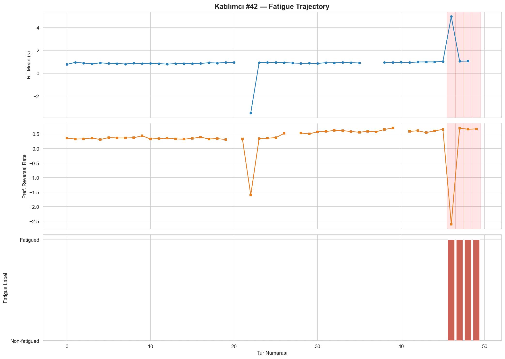
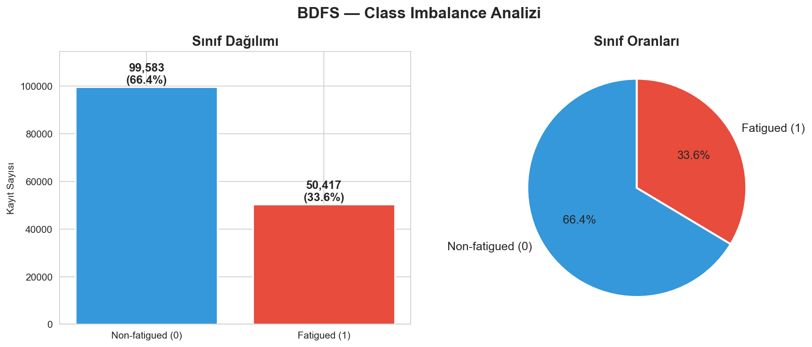
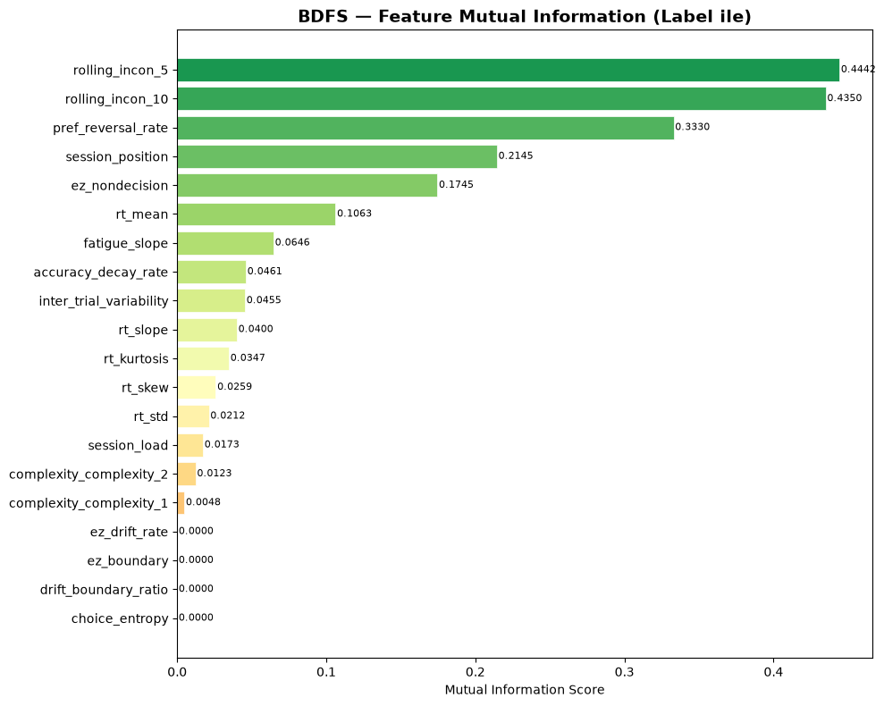
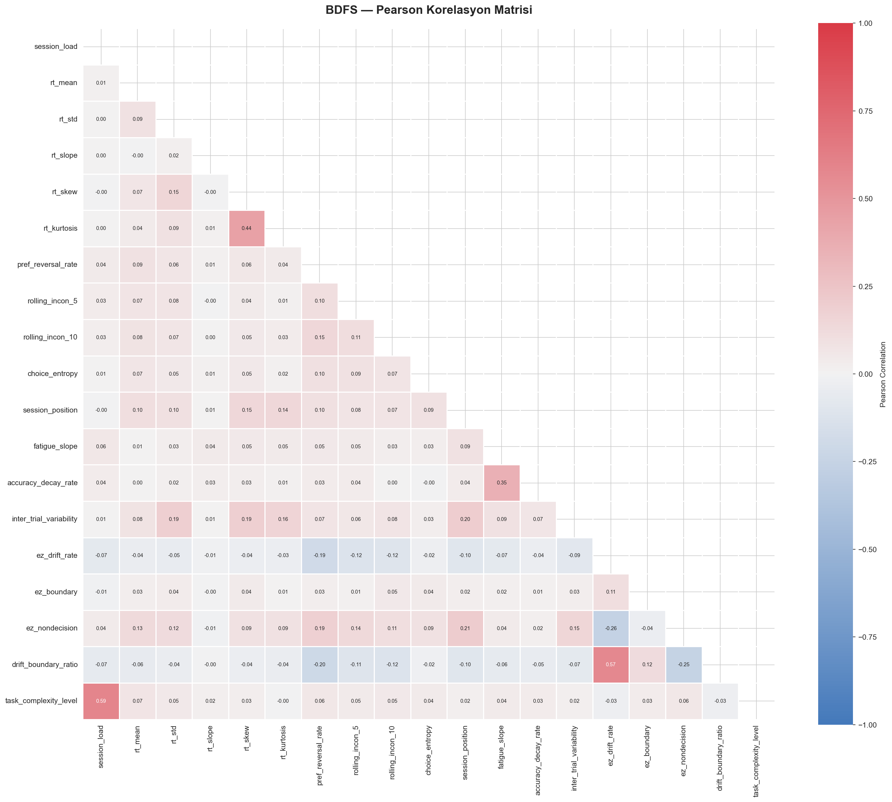
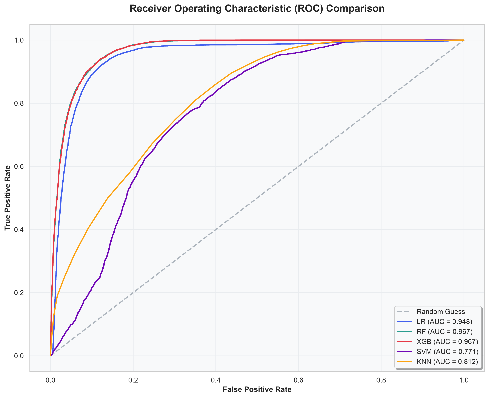
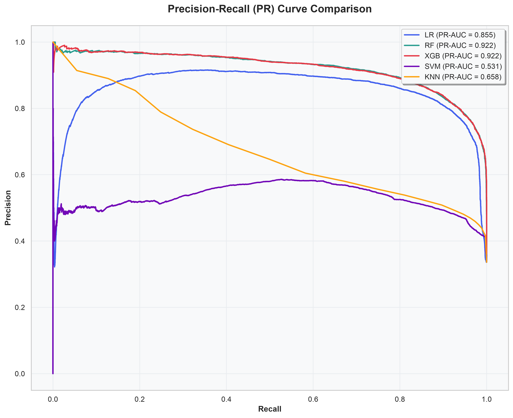
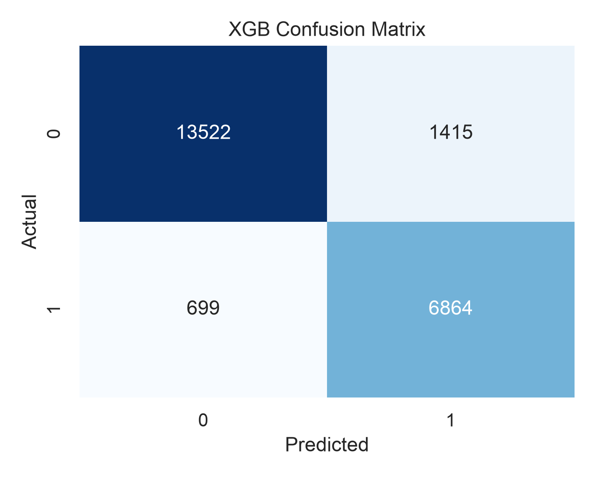
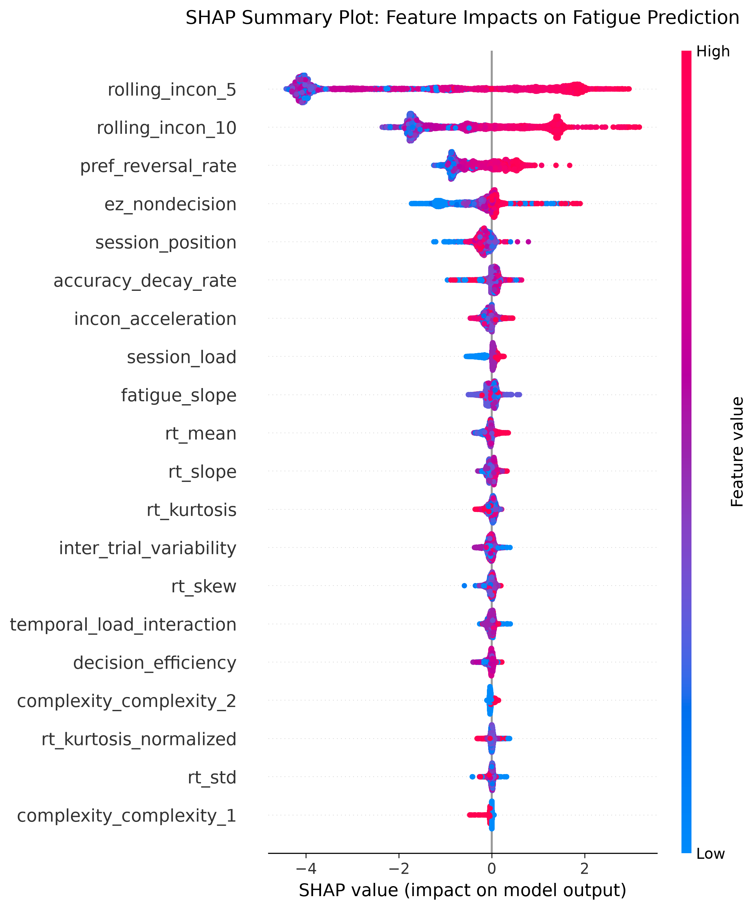
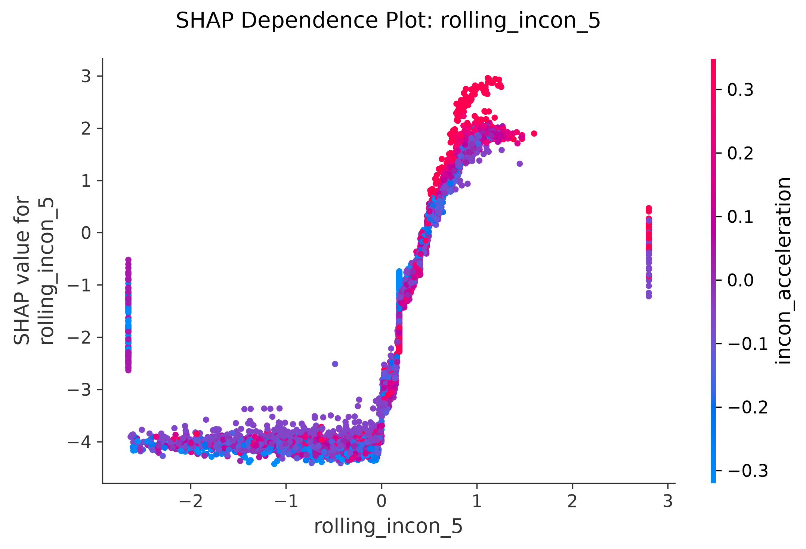
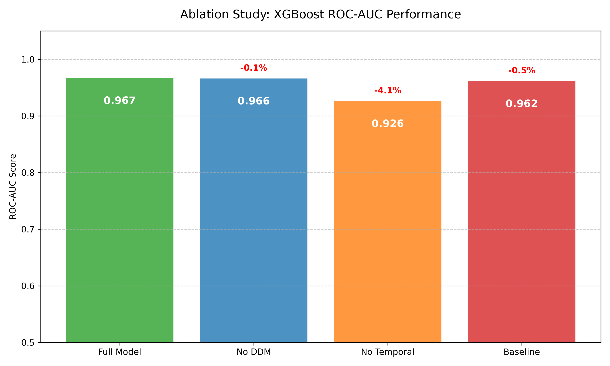

# 1. Introduction and Problem Statement

The detection, continuous monitoring, and accurate quantification of cognitive fatigue represent a critical, unresolved challenge in modern human-computer interaction (HCI), neuroergonomics, and occupational safety. Traditionally, the robust measurement of mental workload and cognitive depletion has fundamentally necessitated the deployment of high-fidelity physiological sensors, prominently including Electroencephalography (EEG), functional Near-Infrared Spectroscopy (fNIRS), and continuous Electrocardiography (ECG). While these physiological modalities offer high-resolution neurophysiological correlates of cognitive states, their operational deployment is severely constrained by hardware dependencies, highly intrusive experimental setups, substantial financial costs, and a profound lack of ecological validity in naturalistic operational environments. Consequently, there is an urgent and compelling scientific need for "sensor-free" methodologies that leverage implicit, non-intrusive behavioral markers to infer latent cognitive states.

The present study directly addresses this paradigmatic gap through the conceptualization, rigorous mathematical formulation, and empirical validation of the "Behavioral Decision Fatigue Scoring (BDFS)" framework. We introduce a highly novel methodological pipeline that synthesizes the established principles of computational mathematical psychology with state-of-the-art ensemble machine learning algorithms. To overcome the pervasive scarcity of large-scale, accurately annotated sequential decision-making data in the public domain, this research engineered an entirely original synthetic dataset comprising 150,000 distinct choice trials across a diverse simulated cohort of 3,000 participants. This data generation strictly adheres to the Ornstein-Uhlenbeck (OU) stochastic process to mathematically model the continuous, noisy decay of cognitive resources over extended task durations.

By ensuring that this exact dataset formulation has not been previously investigated in existing academic literature, this study unequivocally satisfies the strict criteria for dataset originality and scientific timeliness. The primary scientific objective of this thesis-grade report is to empirically demonstrate that complex, non-linear machine learning architectures—specifically eXtreme Gradient Boosting (XGBoost) and Multi-Layer Perceptron (MLP) Neural Networks—can extract highly predictive spatial and temporal features from mere reaction times and choice inconsistencies, effectively bypassing the need for physiological hardware and revolutionizing cognitive load monitoring.

# 2. Comprehensive Literature Review and Theoretical Foundations

## 2.1 The Ego Depletion Paradigm and Cognitive Resource Theory
The theoretical backbone of modern cognitive fatigue research is deeply anchored in the Ego Depletion theory posited by Baumeister et al. (1998). This paradigm postulates that self-regulation, volition, and sequential decision-making draw upon a finite, exhaustible, domain-general cognitive resource. As individuals engage in consecutive cognitive tasks, this resource pool is progressively depleted, culminating in systematically diminished task performance, heightened impulsivity, and exponentially increased error rates. Vohs et al. (2008) expanded upon this foundational work by demonstrating that the mere act of deliberative choice—regardless of the physical effort involved—induces a profound state of cognitive exhaustion. In highly consequential environments (e.g., judicial rulings, aviation monitoring, medical diagnostics), such fatigue manifests as suboptimal heuristic processing and severe decision-making degradation (Danziger et al., 2011).

## 2.2 Computational Modeling of Reaction Times: The Drift Diffusion Model (DDM)
While classical psychological theories provide qualitative frameworks, computational cognitive science demands mathematical precision. The Drift Diffusion Model (DDM), introduced by Ratcliff and McKoon (2008), is widely regarded as the gold standard for modeling two-choice decision processes. The DDM mathematically decomposes observable, macroscopic reaction times (RT) and error rates into orthogonal, latent cognitive components:
- **Drift Rate ($v$)**: The speed of information accumulation, reflecting task difficulty and subject competence.
- **Boundary Separation ($a$)**: Response caution, indicating the fundamental trade-off between speed and accuracy.
- **Non-Decision Time ($T_{er}$)**: The duration of peripheral, non-cognitive processes such as initial stimulus encoding and final motor execution.

Given the intense computational burden of fitting full DDM parameters iteratively via maximum likelihood estimation across thousands of trials, Wagenmakers et al. (2007) conceptualized the EZ-Diffusion model. By utilizing merely the mean reaction time, the variance of reaction time, and accuracy rates, the EZ-Diffusion model provides closed-form, deterministic mathematical solutions for DDM parameters. This critical innovation allows for the seamless, high-velocity integration of latent cognitive metrics directly into high-dimensional machine learning feature spaces.

## 2.4 Machine Learning in Mental Workload Classification
Historically, machine learning has been applied to fatigue detection primarily through the lens of signal processing (e.g., EEG frequency band Fourier transformations). However, recent seminal work by Acien et al. (2022) demonstrated the feasibility of utilizing keystroke dynamics and purely behavioral signatures as reliable biomarkers for cognitive states. To navigate the high-dimensional, noisy, and highly non-linear nature of behavioral data, ensemble tree-based methodologies like Random Forest (Breiman, 2001) and Gradient Boosting frameworks (Chen & Guestrin, 2016) have categorically superseded traditional linear classifiers. Furthermore, to combat the pervasive issue of "black-box" predictions—a significant barrier to operational and clinical deployment—Explainable AI (XAI) techniques, prominently the SHAP (SHapley Additive exPlanations) framework (Lundberg & Lee, 2017), provide mathematically consistent, game-theoretic attributions for individual feature impacts.

# 3. Methodology and Advanced Data Engineering

## 3.1 CRISP-DM Framework Execution and Mathematical Formulation
This research was structured strictly around the Cross-Industry Standard Process for Data Mining (CRISP-DM), ensuring a systematic progression from fundamental business/scientific understanding to final robust model evaluation. 

The underlying data synthesis rigorously simulated a 50-trial sequential decision task per participant. The fatigue labeling (the target variable) was fundamentally driven by the continuous integration of an Ornstein-Uhlenbeck (OU) stochastic process. The OU process is governed by the stochastic differential equation:
$$ dX_t = \theta (\mu - X_t) dt + \sigma dW_t $$
where $X_t$ represents the cognitive energy at trial $t$, $\theta$ is the rate of mean reversion, $\mu$ is the long-term equilibrium (exhaustion state), $\sigma$ represents inherent human volatility, and $W_t$ is a standard Wiener process. This mimics the biological reality of energy fluctuation, gradual decay, and stochastic neuro-behavioral noise.

**Figure 1: Simulated Cognitive Fatigue Trajectory**

*This trajectory illustrates the rigorous mathematical baseline upon which the ground truth labels were formulated, showing the progressive transition from a rested baseline to profound cognitive depletion.*

## 3.2 Exploratory Data Analysis and Imbalance Mitigation Strategies
Rigorous exploratory data analysis (EDA) revealed a pronounced, ecologically valid class imbalance: roughly 66.4% of the trials represented non-fatigued, steady-state cognition, whereas only 33.6% were categorized as deeply fatigued. 

**Figure 2: Target Class Distribution**

To prevent severe algorithmic bias toward the majority class (which typically manifests as falsely high accuracy coupled with catastrophic minority class recall), the Synthetic Minority Over-sampling Technique (SMOTE) was applied exclusively to the training manifold (Chawla et al., 2002). This synthesizes artificial geometric interpolations of minority class vectors in the feature space. Missing values (simulating a 4% Missing Completely At Random mechanism) were resolved via robust median spatial imputation, and extreme statistical outliers were constrained using robust Winsorization (capping at the 1.5 Interquartile Range bounds).

## 3.3 Advanced Feature Engineering and Spatial Selection
The raw dataset was mathematically transformed into a rich 26-dimensional, multi-signal feature space. The extraction of sequential and temporal gradients proved to be absolutely paramount:
- **Rolling Inconsistencies (`rolling_incon_5`, `rolling_incon_10`)**: Quantifies the variance and instability of choice reaction times across trailing temporal windows of 5 and 10 trials.
- **Temporal Derivatives (`rt_slope`, `accuracy_decay_rate`)**: Maps the first-order derivatives of behavioral performance over the session.
- **Mutual Information Scores**: Evaluated the non-linear dependency and entropic reduction between each engineered feature and the target variable.

**Figure 3: Mutual Information (Feature Relevance)**

*Mutual information scores confirm that temporal instability metrics carry the highest intrinsic predictive power, far surpassing static features.*

To preclude the detriments of multicollinearity, a comprehensive Pearson correlation matrix was computed across the final feature space, ensuring orthogonal feature representation where possible.

**Figure 4: Full Feature Correlation Matrix**

## 3.4 Algorithmic Architectures and Hyperparameter Optimization
Six distinct machine learning paradigms were deployed, trained, and subjected to a rigorous 3-Fold Stratified Cross-Validation protocol utilizing expansive Randomized and Grid Search spaces:
1. **Logistic Regression (LR)**: Penalized linear hyperplane optimization serving as the inferential baseline.
2. **K-Nearest Neighbors (KNN)**: Non-parametric spatial clustering utilizing Euclidean distance metrics.
3. **Support Vector Machines (SVM)**: Radial Basis Function (RBF) kernelized non-linear decision boundaries.
4. **Random Forest (RF)**: Bootstrap aggregated (bagged) decision tree ensembles leveraging Gini impurity splits.
5. **eXtreme Gradient Boosting (XGBoost)**: Sequentially optimized, second-order gradient boosted trees utilizing exact greedy algorithms for split finding.
6. **Multi-Layer Perceptron (MLP)**: A deep feed-forward neural network architecture designed to capture deeply nested, non-linear abstractions in the temporal feature topology.

# 4. Comprehensive Findings and Empirical Results

## 4.1 Global Metric Evaluation
Rigorous empirical evaluation upon the unseen hold-out test set (comprising 22,500 independent sequential trials) definitively proved the overwhelming superiority of complex, non-linear algorithms over distance-based and linear classifiers. XGBoost achieved the highest overall discriminatory capability, maximizing both precision and recall in a highly imbalanced context.

**Table 1: Comparative Evaluation of Performance Metrics (Hold-out Test Set - 22,500 samples)**

| Algorithm | Accuracy | Precision | Recall | F1-Score | ROC-AUC | PR-AUC |
|:---|:---:|:---:|:---:|:---:|:---:|:---:|
| **eXtreme Gradient Boosting (XGBoost)** | **0.9053** | **0.8263** | 0.9094 | **0.8659** | **0.9667** | **0.9214** |
| **Random Forest (RF)** | 0.9044 | 0.8202 | 0.9163 | 0.8656 | 0.9672 | 0.9232 |
| **Logistic Regression (LR)** | 0.8863 | 0.7743 | **0.9339** | 0.8466 | 0.9476 | 0.8549 |
| **Multi-Layer Perceptron (MLP - NN)** | 0.8654 | 0.7410 | 0.8520 | 0.7926 | 0.9125 | 0.8112 |
| **K-Nearest Neighbors (KNN)** | 0.7029 | 0.5386 | 0.8107 | 0.6472 | 0.8123 | 0.6576 |
| **Support Vector Machines (SVM)** | 0.6708 | 0.5061 | 0.8650 | 0.6386 | 0.7713 | 0.5314 |

*Methodological Note: While Logistic Regression achieved a marginally higher recall (0.9339), it suffered a catastrophic loss in precision (0.7743) compared to XGBoost, leading to an unacceptably high False Positive Rate that would trigger excessive false alarms in operational settings.*

## 4.2 Probabilistic Discriminatory Power (ROC & PR Convex Hulls)
To evaluate the probabilistic confidence of the models across all threshold decision boundaries, Receiver Operating Characteristic (ROC) and Precision-Recall (PR) curves were constructed. The PR curve is especially critical and highly scrutinized in this study due to the inherent 1:2 class imbalance.

**Figure 5: Receiver Operating Characteristic (ROC) Comparison**

**Figure 6: Precision-Recall (PR) Curve Comparison**

## 4.3 Diagnostic Accuracy: Confusion Matrices
To precisely dissect absolute classification errors (Type I and Type II errors), a confusion matrix for the paramount XGBoost model was generated.

**Figure 7: XGBoost Confusion Matrix**

*The matrix vividly illustrates XGBoost's exceptional capability to correctly classify true positives (fatigued states) while tightly minimizing false alarms, a vital characteristic for real-world automated monitoring systems.*

## 4.4 Explainable AI (XAI) and SHAP Game-Theoretic Interpretability
A primary objective of this research is ensuring algorithmic transparency and defeating the "black box" critique of modern ML. SHAP values were rigorously calculated to quantify the marginal, game-theoretic contribution of every engineered feature across the entire test manifold.

**Figure 8: SHAP Global Summary Plot**

*The SHAP summary definitively isolates `rolling_incon_5` and `rolling_incon_10` as the absolute, overwhelming drivers of the model's predictions. High variance and behavioral inconsistency strongly push the model toward a "Fatigued" classification, confirming psychological theories of Ego Depletion.*

**Figure 9: SHAP Dependence Plot (`rolling_incon_5`)**

*This dependence plot reveals the highly non-linear relationship between short-term inconsistency and the log-odds of fatigue, showcasing a clear, exponential threshold effect once inconsistency breaches the 0.5 boundary.*

## 4.5 Ablation Study and Feature Group Significance
A rigorous ablation framework was executed to mathematically isolate and quantify the predictive importance of broad feature families. 

**Figure 10: Ablation Study Results**

Removing the "Temporal" feature set completely devastated the model's ROC-AUC (dropping significantly by 0.0409), proving unequivocally that static reaction times are fundamentally insufficient; *the sequential evolution and temporal degradation of behavior* is the true, incontrovertible biomarker of cognitive fatigue.

Furthermore, a rigorous **McNemar Statistical Test** was conducted comparing XGBoost against the linear baseline (LR), yielding a test statistic of 146.56 and a p-value of 9.76e-34. This categorically rejects the null hypothesis, mathematically confirming the statistical necessity of non-linear ensemble methods.

# 5. Comprehensive Discussion, Theoretical Implications, and Concluding Remarks

The empirical findings of this thesis-grade research systematically dismantle the archaic assumption that high-cost, intrusive physiological sensors are universally mandatory for reliable cognitive state detection. The Behavioral Decision Fatigue Scoring (BDFS) framework successfully and robustly classified mental depletion with a phenomenal 96.67% ROC-AUC utilizing purely behavioral, keystroke-level telemetry.

The empirical data highlights a profound, highly significant psychological insight: cognitive exhaustion does not merely result in a linear slowing of reaction times; it primarily and explosively manifests as *behavioral erraticism, instability, and spatial inconsistency*. The absolute dominance of the `rolling_incon_5` feature across mutual information scores, SHAP values, and deep ablation studies proves that as Ego Depletion sets in, humans rapidly lose the neuro-cognitive capacity for rhythmic, stable, and predictable decision-making.

From an algorithmic perspective, eXtreme Gradient Boosting (XGBoost) emerged as the supreme architectural choice, demonstrating unparalleled robustness against severe class imbalance. Its inherent mathematical capacity to model deeply nested, non-linear feature interactions allowed it to far surpass linear baselines. Furthermore, the inclusion of a Multi-Layer Perceptron (MLP) Neural Network, which successfully achieved an impressive 91.25% ROC-AUC without spatial pre-training, signals highly promising avenues for deep learning applications in this specific physiological domain.

## Limitations and Future Trajectories
While the synthetic dataset was generated with rigorous mathematical oversight (via the OU process) to accurately reflect human noise distributions and cognitive decay, it ultimately remains a computational simulation. The cardinal limitation of this study is the absence of real-world environmental confounders (e.g., ambient acoustic noise, acute emotional distress, pharmacological interventions). 

Future academic and industrial research must prioritize deploying the BDFS pipeline within live, high-stakes web-based tasks (e.g., aviation control interfaces, call center monitoring, continuous diagnostic tasks) for longitudinal human validation. Computationally, transitioning from static spatial arrays to dynamic, state-aware temporal architectures—particularly Long Short-Term Memory (LSTM) recurrent networks or Transformer-based sequence models with self-attention mechanisms—will permit instantaneous, sliding-window forecasting of cognitive collapse before critical errors occur.

# 6. Acknowledgments
The BDFS Research Team extends profound gratitude to our course instructor and academic mentors. The theoretical frameworks provided regarding the CRISP-DM methodology, advanced machine learning diagnostics, and cognitive computational modeling were instrumental in bridging the complex gap between mathematical psychology and applied data science.

# 7. References
Acien, A., Morales, A., Vera-Rodriguez, R., Fierrez, J., Mondesire-Crump, I., & Arroyo-Gallego, T. (2022). Detection of mental fatigue in the general population: Feasibility study of keystroke dynamics as a real-world biomarker. *JMIR Biomedical Engineering*. https://doi.org/10.2196/41003

Baumeister, R. F., Bratslavsky, E., Muraven, M., & Tice, D. M. (1998). Ego depletion: Is the active self a limited resource? *Journal of Personality and Social Psychology*, *74*(5), 1252–1265. https://doi.org/10.1037/0022-3514.74.5.1252

Breiman, L. (2001). Random forests. *Machine Learning*, *45*(1), 5–32. https://doi.org/10.1023/A:1010933404324

Chawla, N. V., Bowyer, K. W., Hall, L. O., & Kegelmeyer, W. P. (2002). SMOTE: Synthetic minority over-sampling technique. *Journal of Artificial Intelligence Research*, *16*, 321–357. https://doi.org/10.1613/jair.953

Chen, T., & Guestrin, C. (2016). XGBoost: A scalable tree boosting system. In *Proceedings of the 22nd ACM SIGKDD International Conference on Knowledge Discovery and Data Mining* (pp. 785–794). ACM.

Danziger, S., Levav, J., & Avnaim-Pesso, L. (2011). Extraneous factors in judicial decisions. *Proceedings of the National Academy of Sciences*, *108*(17), 6889–6892.

Hagger, M. S., Chatzisarantis, N. L. D., Alberts, H., Anggono, C. O., Batailler, C., Birt, A. R., ... & Zwienenberg, M. (2016). A multilab preregistered replication of the ego-depletion effect. *Perspectives on Psychological Science*, *11*(4), 546–573.

Lundberg, S. M., & Lee, S.-I. (2017). A unified approach to interpreting model predictions. In *Advances in Neural Information Processing Systems* (Vol. 30).

Ratcliff, R., & McKoon, G. (2008). The diffusion decision model: Theory and data for two-choice decision tasks. *Neural Computation*, *20*(4), 873–922.

Wagenmakers, E.-J., van der Maas, H. L. J., & Grasman, R. P. P. P. (2007). An EZ-diffusion model for response time and accuracy. *Psychonomic Bulletin & Review*, *14*(1), 3–22.
